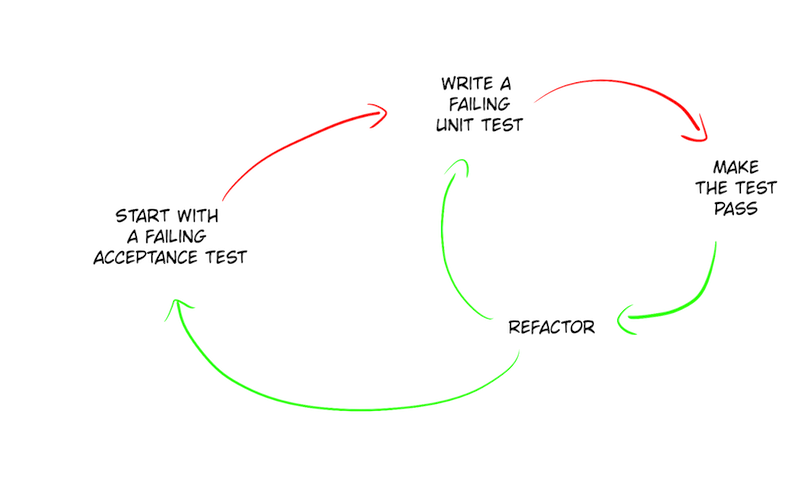

# Evolutionary design workshop

## Experiment deductive approach

In this repo you will find all the materials you need for "Real world Evolutionary Design" hands-on.

[The slides are available here.](http://slides.com/wasselalazhar/real-world-evolutionary-design-with-python)

## Problem description

### Goal

Create a simple command line application that indexes all the text in pictures from a given directory.
Let's call it `pictures-analyzer`.

By launching the following command, all pictures in `images` folder are indexed:

```bash
pictures-analyzer index --directory images
```

### Context

`pictures-analyzer` will interact with two external systems: the safe box and the search engine.

The safe box is a secure storage service used to upload pictures and make them available to allowed users.

Search engine is a REST api that indexes picture content. To be able, to find a picture by the text it contains, `pictures-analyzer` will use the `index` api to bind the picture in the safe box and its text.


## Iteration 1: Micro design

* Time: 30 min
* Definition of done:
  * Implement `Analyzer.index()` method and all its unit tests
  * If you have enough time, make the acceptance test pass
* Rules:
  1. Write one first unit test at the top
  1. Whenever your test or implementation needs something, create a stub
  1. Write the next unit test until you reach the bottom layer
* Constraints:
  1. TDD:
      * RED: Write only one failing unit test at time
      * GREEN: Write only enough amount of code to make this failing test pass
      * REFACTOR: Clean up the mess you just made (Think about naming, magic values, non accidental duplication...)
  1. You should never modify the given acceptance test. Therefore, you can modify the setup section of this test if needed
  1. In `Analyzer` class, you are not allowed to import any code (type, library, module, object, whatever...) outside its package  library
  1. You are not allowed to add any other public methods in this class

### Get started

* Get the code in your favorite programming language _(python or java)_

  ```bash
  ./start_workshop.sh
  ```

* Run all the tests
* You should have only one failing test. It is an acceptance test
* Take a look at this test and understand what is missing
* This test should guide your implementation

> :bulb: Take a look at the step by step instructions for [python](python/step-by-step-python.md) and [java](java/step-by-step-java.md).



## Iteration 2: Macro design

* Time: 20 min
* Goal:
  * Think about a better way to restructure files in packages.
  * Take advantage of the test harness to refactor.
* Hints:
  * Get the code

  ```bash
  ./start_workshop.sh 2
  ```

  * Now, the **acceptance test is passing**.
  * Take a look at the implementation.
  * What do you like about this implementation?
  * What would you do better?
  * What was hard to change?
  * Identify where the external libraries are imported.


