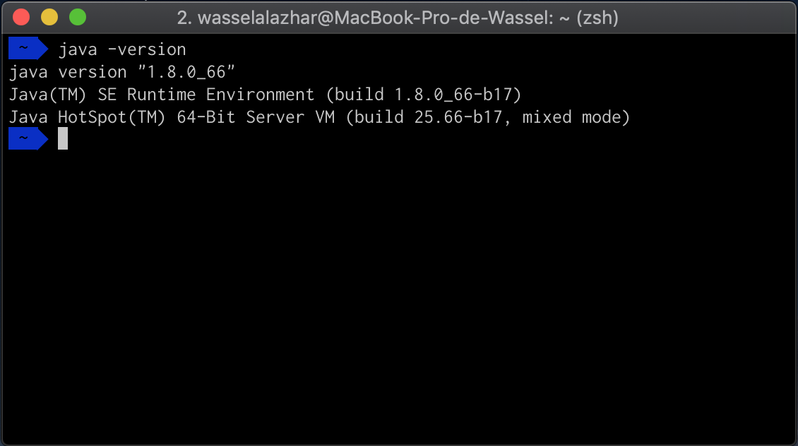
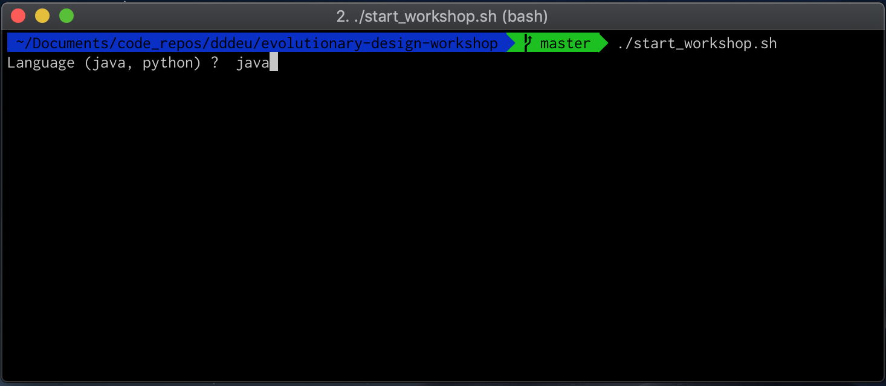
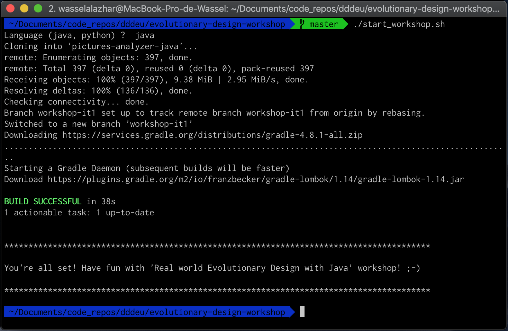

# Get started for evolutionary design workshop (java version)

1. Install java 8+ SDK
    - [Download](https://www.oracle.com/technetwork/java/javase/downloads/jdk8-downloads-2133151.html) and [install](https://docs.oracle.com/javase/8/docs/technotes/guides/install/install_overview.html#A1096936) java 8 sdk. _It should be fine if you have installed version of sdk greater than 8 (i.e. 9, 10, 11 or 12)_
    - Check:
        

1. Clone the repo
    ```bash
    git@github.com:jcraftsman/evolutionary-design-workshop.git
    ```

1. Get ready for the workshop
    - After cloning this repo, move to the folder, launch the script `start_workshop.sh` and type `java`:
        ```bash
        cd evolutionary-design-workshop
        ./start_workshop.sh
        ```
        
    - You will have the following output if everything goes well:
        