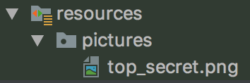
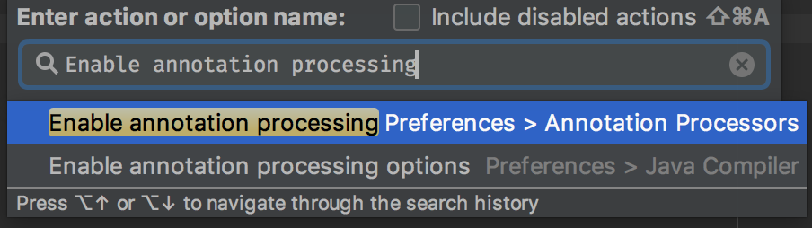
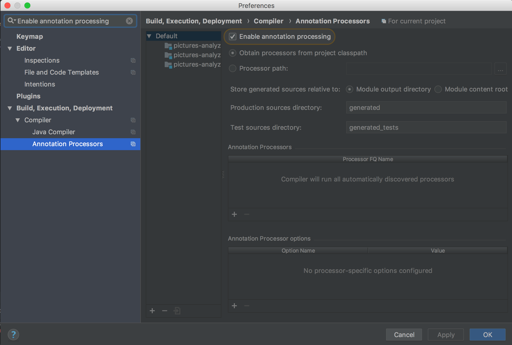

# Step by step instructions for java

## Get started

After cloning this repo, all you need to do is to launch the script `start_workshop.sh`:

```bash
./start_workshop.sh
```

This will generate `pictures-analyzer` project in the same directory:

```bash
evolutionary-design-workshop
├── README.md
├── pictures-analyzer-java
│   ├── build.gradle
│   ├── gradle
│   ├── gradlew
│   ├── gradlew.bat
│   ├── settings.gradle
│   └── src
│       ├── main
│       │   └── java
│       │       └── org
│       │           └── evolutionary
│       │               ├── Analyzer.java
│       │               ├── PictureContent.java
│       │               ├── SafeBox.java
│       │               └── SearchEngine.java
│       └── test
│           ├── java
│           │   └── feature
│           │       └── IndexPictureContentFeature.java
│           └── resources
│               └── pictures
│                   └── top_secret.png
└── start_workshop.sh
```

Move to the generated project, and open it using your favorite IDE.

```bash
cd pictures-analyzer-java
```

> Something went wrong?
>
>Take a look at "[Need help?](#need-help)" section. You're may be missing some [prerequisites](#prerequisites).

## The starting point

### Analyzer class

```java

public class Analyzer {
    public void index(String picturesDirectoryPath) {
    }
}
```

The `Analyzer` class contains only one public method `index`. It's a **command** _(i.e., it doesn't return any value)_ that takes `picturesDirectoryPath` as unique parameter.

### Outer loop RED: :dart: A failing acceptance test

Now, let's take a look at the acceptance test `feature.IndexPictureContentFeature.java`:

```java
    @Test
    void should_use_searchEngine_to_index_analyzed_picture_content() {
        // Given
        given(safeBox.upload(PATH_TO_A_PICTURE_FILE)).willReturn(PUBLISHED_PICTURE_URL);

        // When
        analyzer.index(PICTURES_DIRECTORY_PATH);

        // Then
        PictureContent analyzedPictureContent = new PictureContent(PICTURE_FILE_NAME, PUBLISHED_PICTURE_URL, TEXT_IN_PICTURE);
        then(searchEngine).should().index(analyzedPictureContent);
    }
```

As `index()` method is a command, the expected behaviour is described through the side effects on external systems.

In this test, external systems `safeBox` and `searchEngine` are substituted by mocks in order to control the side effects on them.

* Let's run the tests

```bash
  ./gradlew test
```

* Did the test fail for the good reason?

If you got this failing message :point_down:, the answer is yes!

```bash
> Task :test FAILED

feature.IndexPictureContentFeature > should_use_search_engine_to_index_analyzed_picture_content() FAILED
    org.mockito.exceptions.verification.WantedButNotInvoked at IndexPictureContentFeature.java:47

```

```bash
Wanted but not invoked:
searchEngine.index(
    PictureContent(name=top_secret.png, url=https://s3.eu-west-3.amazonaws.com/evolutionary-confidential/agent-phillip/top_secret.png, description=Rezidentura)
);
-> at feature.IndexPictureContentFeature.should_use_search_engine_to_index_analyzed_picture_content(IndexPictureContentFeature.java:47)
Actually, there were zero interactions with this mock.

Wanted but not invoked:
searchEngine.index(
    PictureContent(name=top_secret.png, url=https://s3.eu-west-3.amazonaws.com/evolutionary-confidential/agent-phillip/top_secret.png, description=Rezidentura)
);
-> at feature.IndexPictureContentFeature.should_use_search_engine_to_index_analyzed_picture_content(IndexPictureContentFeature.java:47)
Actually, there were zero interactions with this mock.

    at feature.IndexPictureContentFeature.should_use_search_engine_to_index_analyzed_picture_content(IndexPictureContentFeature.java:47)
```

Indeed, the acceptance test is failing because the search engine did not get called during `Analyze.index` command.

## Inner loop: First unit test

### :red_circle: RED

Now, we can write a first unit test for the analyzer class.

Let's focus on the first requirement about uploading the picture to the safe box, as described in the acceptance test:

```java
        // Given
        given(safeBox.upload(PATH_TO_A_PICTURE_FILE)).willReturn(PUBLISHED_PICTURE_URL);

        // When
        analyzer.index(PICTURES_DIRECTORY_PATH);
```

`index` takes a directory path as input. The `safeBox` mock expects a path to a picture file inside this directory.



We can start writing our first unit test like this:

```java
    @Test
    void should_upload_a_file_to_the_safeBox() {
        // Given
        String pathToPicture = "/users/me/pictures/top-secret.jpeg";

        // When
        analyzer.index("/users/me/pictures");

        // Then
        then(safeBox).should().upload(pathToPicture);
    }
```

### :white_check_mark: GREEN: Make it pass

Does the test fail for the good reason?

```bash
Wanted but not invoked:
safeBox.upload(
    "/users/me/pictures/top-secret.jpeg"
);
-> at org.evolutionary.AnalyzerTest.should_upload_one_file_to_the_safeBox_when_the_pictures_directory_contains_only_one_picture_file(AnalyzerTest.java:50)
Actually, there were zero interactions with this mock.

Wanted but not invoked:
safeBox.upload(
    "/users/me/pictures/top-secret.jpeg"
);
-> at org.evolutionary.AnalyzerTest.should_upload_one_file_to_the_safeBox_when_the_pictures_directory_contains_only_one_picture_file(AnalyzerTest.java:50)
Actually, there were zero interactions with this mock.
```

Let's take care of this.

Let's write only enough amount of code to make this test pass.

For instance, we can make the first assertion pass with this line of code:

```java
    public void index(String picturesDirectoryPath) {
        safeBox.upload("/users/me/pictures/top-secret.jpeg");
    }
```

Yeey, it works!

In this implementation, the `safeBox` was injected directly in the analyzer:

```java
    private final SafeBox safeBox;

    public Analyzer(SafeBox safeBox) {
        this.safeBox = safeBox;
    }
```

### :large_blue_circle: REFACTOR: Clean it up

We can explicitly introduce the notion of picture file path in our implementation:

```java
    public void index(String picturesDirectoryPath) {
        String pictureFilePath = "/users/me/pictures/top-secret.jpeg";
        safeBox.upload(pictureFilePath);
    }
```

But the value of this picture path is still magical. And extracting it in a variable doesn't make up for this.

The good news is that both notions of pictures directory path and picture file path are explicit in our implementation.

To stop faking it, we need to get this file path from the directory path, somehow. But first let's express this in our unit test.

### :red_circle: RED: Wishful thinking

At this point, we don't care about low level details in the Analyzer class.
But, we still need to list file paths within the directory.

> This is where we will play with the rule #2:
>
> :relieved:  Whenever your test or implementation needs something, create a stub!

So, we can introduce a file_finder (`self.finder = Mock()`) that will provide us with this abstraction.

Our first unit test becomes as follows:

```java
    @Test
    void should_upload_one_file_to_the_safeBox_when_the_pictures_directory_contains_only_one_picture_file() {
        // Given
        String pathToPicture = "/users/me/pictures/top-secret.jpeg";
        List<String> allPathsInPicturesDirectory = singletonList(pathToPicture);
        given(finder.listFilePaths(PICTURES_DIRECTORY_PATH))
                .willReturn(allPathsInPicturesDirectory);

        // When
        analyzer.index(PICTURES_DIRECTORY_PATH);

        // Then
        then(safeBox).should().upload(pathToPicture);
    }
```

### :white_check_mark: GREEN: Make it pass, again

Now, it fails for another reason:

```java
org.mockito.exceptions.misusing.UnnecessaryStubbingException:
Unnecessary stubbings detected.
Clean & maintainable test code requires zero unnecessary code.
Following stubbings are unnecessary (click to navigate to relevant line of code):
  1. -> at org.evolutionary.AnalyzerTest.should_upload_one_file_to_the_safeBox_when_the_pictures_directory_contains_only_one_picture_file(AnalyzerTest.java:46)
Please remove unnecessary stubbings or use 'lenient' strictness. More info: javadoc for UnnecessaryStubbingException class.
```

We need to call `listFilePaths`. Let's do it:

```java
public class Analyzer {
    private final Finder finder;
    private final SearchEngine searchEngine;
    private final SafeBox safeBox;

    public Analyzer(Finder finder, SearchEngine searchEngine, SafeBox safeBox) {
        this.finder = finder;
        this.searchEngine = searchEngine;
        this.safeBox = safeBox;
    }

    public void index(String picturesDirectoryPath) {
        safeBox.upload("/users/me/pictures/top-secret.jpeg");
        finder.listFilePaths("/users/me/pictures");
    }
}
```

Our test is green! :tada:

*NB:*

Make sure to throw an explicit exception in the methods that are not yet implemented.

```java
public class Finder {
    public Iterable<String> listFilePaths(String picturesDirectoryPath) {
        throw new UnsupportedOperationException();
    }
}
```

And update the acceptance test setup with a real instance of `Finder`. No more mocks in the acceptance test `IndexPictureContentFeature`. _(reminder: only external systems are mocked, in the acceptance test class)_

```java
    @BeforeEach
    void setUp() {
        searchEngine = mock(SearchEngine.class);
        safeBox = mock(SafeBox.class);
        Finder localFilesFinder = new Finder();
        analyzer = new Analyzer(localFilesFinder, searchEngine, safeBox);
    }
```

### :large_blue_circle: REFACTOR: Clean it up, again

OK, the test is green. But let's clean this mess.

First, we can use the method's parameter instead of a magic value.

```java
    public void index(String picturesDirectoryPath) {
        safeBox.upload("/users/me/pictures/top-secret.jpeg");
        finder.listFilePaths(picturesDirectoryPath);
    }
```

And, to get rid of magic values, we can extract `listFilePaths` result in a variable and use it.

```java
    public void index(String picturesDirectoryPath) {
        Iterable<String> filePathsInDirectory = finder.listFilePaths(picturesDirectoryPath);
        safeBox.upload(filePathsInDirectory.iterator().next());
    }
```

Now, I'm happy! There is no more magic values.

But, I would, maybe, rename some variables, class...

### Inner loop RED/GREEN/REFACTOR: :red_circle::large_blue_circle::white_check_mark: Next unit tests

What would you test next?
Indexing in the search engine? Or maybe, would you write a test about a directory with more than a single file?

It's up to you :wink:!

Here are some tips that might be useful:

* Start with primitives or simple types, like strings for path variables
* Introduce only one concept at time
* Focus on the happy path. Don't worry about what could go wrong in corner cases. In the begining, just throw a runtime exception (`throw new UnsupportedOperationException();`). You will take care of it later if necessary

### Outer loop RED: :dart: Done with Analyzer unit tests?

Did you finish all unit tests for Analyzer class?
Run the acceptance test, it will point the next unit test to write!

For instance, in the following output, the acceptance test is telling us to implement `finder.listFilePaths`.
This is why we call it a guiding test.

```bash
java.lang.UnsupportedOperationException
    at org.evolutionary.Finder.listFilePaths(Finder.java:5)
    at org.evolutionary.Analyzer.index(Analyzer.java:15)
    at feature.IndexPictureContentFeature.should_use_search_engine_to_index_analyzed_picture_content(IndexPictureContentFeature.java:41)
```

## :warning: Design alert :warning:

> By writing our first failing unit test we have already made a design decision.

In the first unit test, we have:

* introduced an abstraction about file paths in a directory
* defined the collaboration between the `Analyzer`, the safe box and the file finder

From the `Analyzer`point of view, we have chosen to decompose the upload operation into 2 pieces:

1. Fetch files in given pictures directory
2. Upload each file to the safe box

An alternative would be to take the upload operation as a whole.
In this case, we introduce an abstraction that takes a directory as parameter.
The result of this operation will be incrementally refined through the next tests.


## Need help?

### Prerequisites

In this workshop you will need:

* Git (obviously)
* java 8

#### Mac OS

For the iteration 2, you will also need to install [tesseract](https://github.com/tesseract-ocr):

```bash
brew install tesseract
```

#### Ubuntu

For the iteration 2, you will also need to install [tesseract](https://github.com/tesseract-ocr):

```bash
sudo apt-get install tesseract-ocr
```

### Libraries

#### Lombok _(to reduce verbosity)_

* [Documentation](https://projectlombok.org/features/all)
* Configure IntelliJ:
  1. Install [lombok plugin](https://plugins.jetbrains.com/plugin/6317-lombok-plugin)
  1. Enable annotation processing (find the action _cmd+Shift+A_)

  

  

#### Junit 5 _(to run tests)_

* [Documentation](https://junit.org/junit5/docs/current/user-guide/#writing-tests)

#### AssertJ _(to write fluent assertions)_

* [Documentation](http://joel-costigliola.github.io/assertj)

#### Mockito _(for mocking and stubbing: to isolate the unit under test)_

* [Documentation](http://static.javadoc.io/org.mockito/mockito-core/2.22.0/org/mockito/Mockito.html)
* Example of unit test class setup **using mockito annotations**:

  ```java
  @ExtendWith(MockitoExtension.class)
  class AnalyzerTest {
  
      private static final String PICTURES_DIRECTORY_PATH = "/users/me/pictures";
  
      @InjectMocks
      private Analyzer analyzer;
  
      @Mock
      private Finder finder;
      @Mock
      private SafeBox safeBox;
      @Mock
      private SearchEngine searchEngine;
  
      @Test
      void should_upload_one_file_to_the_safeBox_when_the_pictures_directory_contains_only_one_picture_file() {
          // Given
          String pathToPicture = "/users/me/pictures/top-secret.jpeg";
          List<String> allPathsInPicturesDirectory = singletonList(pathToPicture);
          given(finder.listFilePaths(PICTURES_DIRECTORY_PATH))
                  .willReturn(allPathsInPicturesDirectory);
  
          // When
          analyzer.index(PICTURES_DIRECTORY_PATH);
  
          // Then
          then(safeBox).should().upload(pathToPicture);
      }
  }
  ```