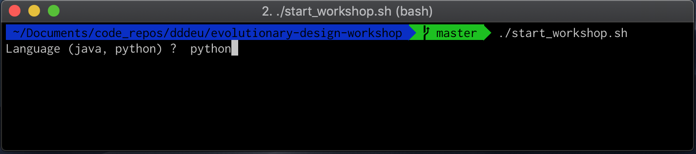
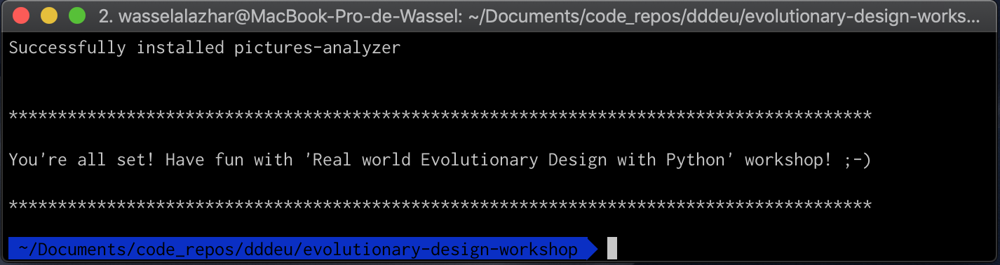

# Get started for evolutionary design workshop (python version)

1. Install python 3.6+ SDK

    - For **Mac OS** users, you can use homebrew:
        ```bash
        brew update
        brew install python3
        pip3 install virtualenv
        ```
    - For ubuntu users, you can use apt:
        ```bash
        apt-get install -y software-properties-common python-software-properties
        add-apt-repository ppa:jonathonf/python-3.6
        apt-get update
        apt-get install python3.6
        pip3 install virtualenv
        ln -sf /usr/bin/python3 /usr/local/bin/python3
        ```
    - For other platforms, [download](https://www.python.org/downloads/) and install python 3.6+

1. Clone the repo
    ```bash
    git@github.com:jcraftsman/evolutionary-design-workshop.git
    ```

1. Get ready for the workshop
    - After cloning this repo, move to the folder, launch the script `start_workshop.sh` and type `python`:
        ```bash
        cd evolutionary-design-workshop
        ./start_workshop.sh
        ```
        
    - You will have the following output if everything goes well:
        