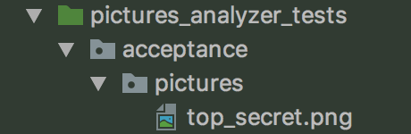
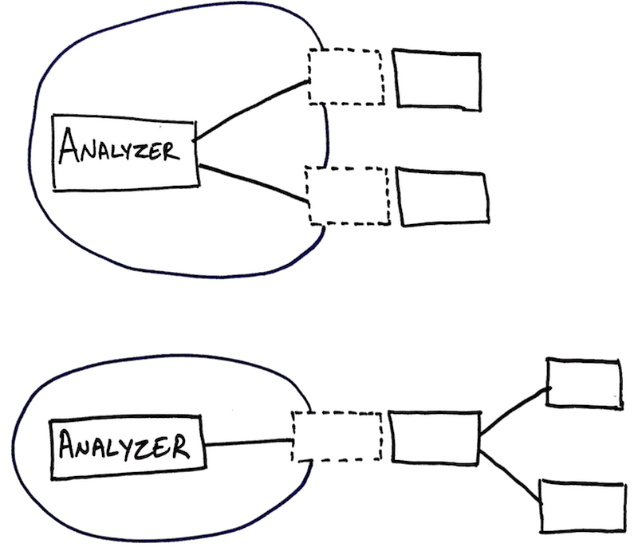

# Step by step instructions for python

## Get started

After cloning this repo, all you need to do is to launch the script `start_workshop.sh`:

```bash
./start_workshop.sh
```

This will generate `pictures-analyzer` project in the same directory:

```bash
evolutionary-design-workshop
├── README.md
├── pictures-analyzer
│   ├── Makefile
│   ├── README.md
│   ├── pictures_analyzer
│   │   ├── __init__.py
│   │   ├── __main__.py
│   │   ├── analyzer.py
│   │   ├── safe_box.py
│   │   └── search_engine.py
│   ├── pictures_analyzer_tests
│   │   ├── __init__.py
│   │   └── acceptance
│   │       ├── __init__.py
│   │       ├── pictures
│   │       │   └── top_secret.png
│   │       └── test_analyzer.py
│   ├── requirements_dev.txt
│   └── setup.py
└── start_workshop.sh
```

Move to the generated project, and open it using your favorite IDE.

```bash
cd pictures-analyzer
```

> Something went wrong?
>
>Take a look at "[Need help?](#need-help)" section. You're may be missing some [prerequisites](#prerequisites).

## The starting point

### Analyzer class

```python

class Analyzer(object):

    def index(self, pictures_directory_path) -> None:
        pass
```

The `Analyzer` class contains only one public method `index`. It's a **command** _(i.e., it doesn't return any value)_ that takes `pictures_directory_path` as unique parameter.

### Outer loop RED: :dart: A failing acceptance test

Now, let's take a look at `acceptance.test_analyzer.py`:

```python
    def test_index_should_use_search_engine_to_index_published_image_and_the_text_it_contains(self):
        # Given
        self.safe_box.upload.side_effect = [PUBLISHED_PICTURE_URL]

        # When
        self.analyzer.index(PICTURES_DIRECTORY_PATH)

        # Then
        self.search_engine.index.assert_called_once_with({'name': PICTURE_FILE_NAME,
                                                          'url': PUBLISHED_PICTURE_URL,
                                                          'description': IMAGE_TO_TEXT})
        self.safe_box.upload.assert_called_once_with(PATH_TO_PICTURE_FILE)
```

As `index()` method is a command, the expected behaviour is described through the side effects on external systems.

In this test, external systems `safe_box` and `search_engine` are substituted by mocks in order to control the side effects on them.

* Let's run the tests

```bash
  make tests
```

* Did the test fail for the good reason?

If you got this :point_down: failing message (`AssertionError: Expected 'index' to be called once. Called 0 times.`), the answer is yes!

```bash
F
======================================================================
FAIL: test_index_should_use_search_engine_to_index_published_image_and_the_text_it_contains (acceptance.test_analyzer.TestAnalyzer)
----------------------------------------------------------------------
Traceback (most recent call last):
  File "/Users/wasselalazhar/code_repos/pictures-analyzer/pictures_analyzer_tests/acceptance/test_analyzer.py", line 33, in test_index_should_use_search_engine_to_index_published_image_and_the_text_it_contains
    'description': IMAGE_TO_TEXT})
  File "/usr/local/Cellar/python/3.6.4_3/Frameworks/Python.framework/Versions/3.6/lib/python3.6/unittest/mock.py", line 824, in assert_called_once_with
    raise AssertionError(msg)
AssertionError: Expected 'index' to be called once. Called 0 times.

----------------------------------------------------------------------
Ran 1 test in 0.001s

FAILED (failures=1)
```

Indeed, the acceptance test is failing because the search engine did not get called during `Analyze.index` command.

### Inner loop RED: :red_circle: More than a failing Unit test

Now, we can write a first unit test for the analyzer class.

Let's focus on the first requirement about uploading the picture to the safe box, as described in the acceptance test:

```python
        # When
        self.analyzer.index(PICTURES_DIRECTORY_PATH)

        # Then
        self.safe_box.upload.assert_called_once_with(PATH_TO_PICTURE_FILE)
```

`index` takes a directory path as input. The safe_box mock expects a path to a picture file inside this directory.



We can start writing our first unit test like this:

```python
    def test_index_should_upload_a_file_to_safebox_when_there_is_one_file_in_directory(self):
        # Given
        picture_path = './top_secrets.png'

        # When
        self.analyzer.index('./pictures')

        # Then
        self.safe_box.upload.assert_called_once_with(picture_path)
```

At this point, we don't care about low level details in the Analyzer class.
But, we still need to list file paths within the directory.

> This is where we will play with the rule #2:
>
> :relieved:  Whenever your test or implementation needs something, create a stub!

So, we can introduce a file_finder (`self.finder = Mock()`) that will provide us with this abstraction.

Our first unit test becomes as follows:

```python
    def test_index_should_upload_a_file_to_safebox_when_there_is_one_file_in_directory(self):
        # Given
        picture_path = './top_secrets.png'
        self.finder.list_directory.return_value = [picture_path]

        # When
        self.analyzer.index('./pictures')

        # Then
        self.safe_box.upload.assert_called_once_with(picture_path)
        self.finder.list_directory.assert_called_once_with('./pictures')
```

### Inner loop GREEN: :white_check_mark: Make it pass

Does the test fail for the good reason?

```bash
AssertionError: Expected 'upload' to be called once. Called 0 times.
```

Let's take care of this.

Let's write only enough amount of code to make this test pass.

For instance, we can make the first assertion pass with this line of code:

```python
    def index(self, pictures_directory_path) -> None:
        self.safe_box.upload('./top_secrets.png')
```

Yeey, it's working!
Now, it fails for the another reason:

```python
AssertionError: Expected 'list_directory' to be called once. Called 0 times.
```

We need to call `list_directory`. Let's do it:

```python
class Analyzer(object):

    def __init__(self, finder: Finder, search_engine: SearchEngine, safe_box: SafeBox):
        self.ocr = ocr
        self.finder = finder
        self.safe_box = safe_box

    def index(self, pictures_directory_path) -> None:
        self.safe_box.upload('./top_secrets.png')
        self.finder.list_directory('./pictures')
```

Our test is green! :tada:

I make sure to throw an explicit exception in the methods that are not yet implemented.

```python
class Finder(object):
    def list_directory(self, directory_path) -> List[File]:
        raise NotImplementedError()
```

And we update the acceptance test setup with a real instance of `Finder`. No more mocks in the acceptance test. _(reminder: only external systems are mocked, in the acceptance test class)_

```python
    def setUp(self):
        self.search_engine = Mock()
        self.safe_box = Mock()
        finder = Finder()
        self.analyzer = Analyzer(finder, self.safe_box, self.safe_box)
```

### Inner loop REFACTOR: :large_blue_circle: Clean it up

OK, the test is green. But let's clean this mess.

First, we can use the method's parameter instead of a magic value.

```python
    def index(self, pictures_directory_path) -> None:
        self.finder.list_directory(pictures_directory_path)
        picture_path = './top_secrets.png'
        self.safe_box.upload(picture_path)
```

And to get rid of magic values, so far, we can extract `list_directory` result in a variable and use it.

```python
    def index(self, pictures_directory_path) -> None:
        file_paths_in_directory = self.finder.list_directory(pictures_directory_path)
        picture_path = next(iter(file_paths_in_directory))
        self.safe_box.upload(picture_path)
```

Now, I'm happy! There is no more magic values.

But, I would, maybe, rename some variables, class...

### Inner loop RED/GREEN/REFACTOR: :red_circle::large_blue_circle::white_check_mark: Next unit tests

What would you test next?
Indexing in the search engine? Or, maybe would you write a test about a directory with more than a single file?

It's up to you :wink:!

Here are some tips that may be useful for the rest of this hands on:

* Focus on the happy path. Don't worry about what may go wrong in corner cases. In the begining, you can mange to just throw a runtime exception (`raise NotImplementedError()`) for instance, and you will take care of it later.
* Start with primitives or simple types, like strings for path variables.

### Outer loop RED: :dart: Done with Analyzer unit tests?

Did you finish all unit tests for Analyzer class ?
Run the acceptance test, it will point the next unit test to write!

For instance, in the following output, the acceptance test is telling us to implement `finder.list_directory`.
This is why it is usual to call this kind of test a guiding test.

```bash
ERROR: test_index_should_use_search_engine_to_index_published_image_and_the_text_it_contains (acceptance.test_analyzer.TestAnalyzer)
----------------------------------------------------------------------
Traceback (most recent call last):
  File "/Users/wasselalazhar/code_repos/pictures-analyzer/pictures_analyzer_tests/acceptance/test_analyzer.py", line 34, in test_index_should_use_search_engine_to_index_published_image_and_the_text_it_contains
    self.analyzer.index(PICTURES_DIRECTORY_PATH)
  File "/Users/wasselalazhar/code_repos/pictures-analyzer/pictures_analyzer/analyzer.py", line 14, in index
    file_paths_in_directory = self.finder.list_directory(pictures_directory_path)
  File "/Users/wasselalazhar/code_repos/pictures-analyzer/pictures_analyzer/finder.py", line 6, in list_directory
    raise NotImplementedError()
NotImplementedError

----------------------------------------------------------------------
Ran 1 test in 0.001s

```

### :warning: Design alert :warning:

> By writing our first failing unit test we have already made a design decision.
>
> First, we need the analyzer to look into the files within the pictures directory.
>
> Then, we need to upload them into the safe box.

We can choose to take this requirement as a whole:
Analayzer should 

Or, you may decide to decompose it:

Analyzer -> should fetch files in given pictures directory
Analyzer -> should upload each file to the safe box




## Libraries
unittest
how to create a mock/stub

## Need help?

### Prerequisites

In this workshop you will need:

* Git (obviously)
* Python 3.5+
* Virtualenv

#### Mac OS

The simplest way to install python3 and virtualenv is to rely on hombrew and pip.

```bash
brew update
brew install python3
pip3 install virtualenv
```

This implies that you have xcode, Homebrew and pip3 installed.
If you miss some of these pre-requisites, you can take a look [here](https://www.digitalocean.com/community/tutorials/how-to-install-python-3-and-set-up-a-local-programming-environment-on-macos)
for a more exhaustive setup instructions.

After installation, the version of python3 on your computer should be higher than 3.5

```bash
python3 --version
```

For the iteration 2, you will also need to install [tesseract](https://github.com/tesseract-ocr):

```bash
brew install tesseract
```

#### Ubuntu

Here are the instructions to install python 3.6 from PPA:

```bash
apt-get install software-properties-common python-software-properties
add-apt-repository ppa:jonathonf/python-3.6
# and press enter to continue.
apt-get update
apt-get install python3.6
pip3 install virtualenv
```

For further details, take a look [here](https://www.rosehosting.com/blog/how-to-install-python-3-6-on-ubuntu-16-04).

For the iteration 2, you will also need to install [tesseract](https://github.com/tesseract-ocr):

```bash
sudo apt-get install tesseract-ocr
```
